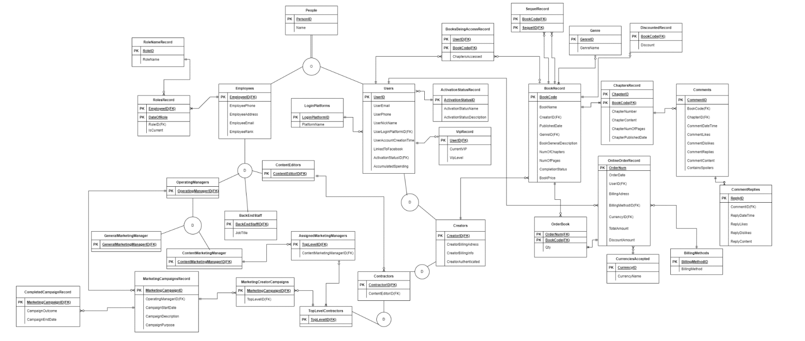

# Database design for Ace Web Comics
Logical Database design for Ace Web Comics.

## About
This project is from a university assignment. We were tasked to create the logical database design for ace web comics based on a text description of the businesses case, we were first tasked to create an initial ERD then incorporate it with the online order system. 

## The case of Ace Web Comics

Ace WebComics is a leading online web comics platform that allows creators to publish their comics and reach thousands of readers online. The platform has been in operation for 8 years and has over 200 employees currently. It boasts a user base of nearly 1,000,000 users, of which over 10,000 are comic creators. The following specification and documents capture only part of the data requirement for Ace
WebComics.

All platform employees should have their personal information stored in the database (i.e. name, age, gender, phone number, address, email and rank). It is also important to keep track of an employee’s role at a specific time as employees may rotate roles throughout their employment. Interviews with stakeholders have
revealed the following details regarding employees:

• Operating managers evaluate, design, and conduct marketing campaigns for various situations. The start and end date, description, purpose, and outcome of each marketing campaign is recorded. 

- Some operating managers are called general marketing managers. General marketing managers are in charge of marketing campaigns that promote the entire platform and increase the platform’s exposure such as improving new user attraction, existing user retention and freemium to premium conversion, etc.

- Some operating managers, however, only work with the platform’s top ranked creators (with contracts) and offer personalised marketing campaigns that are tailored to their works. They are called content marketing managers. One content marketing manager may be in charge of multiple creators, whereas one creator has only one content marketing manager.

• Content editors provide advice for creators and oversee the quality and direction of their works. One content editor may be in charge of multiple creators, whereas one creator has only one content editor. Content editors’ experience is recorded in the database, too.

• Backend staff manage various administrative and backend matters within the company such as evaluating, designing, and implementing platform features suitable for various situations, maintaining the platform, facilitating recruitment events etc. These backend staff are employees who are not directly involved in comic-specific matters, such as product managers, web developers, HR managers, etc. Their job title is recorded.

The platform allows anyone with a valid email address to register for a user account. User information including user id, email, nickname, login platform, account creation time, whether the account is linked to Facebook, and activation status, should be recorded in the database. Recording the status for each user as
"activated" or "not activated" is important for the platform to keep track of the number of valid registrations. A short description of how to define the activation status of an account should also be recorded in the database.

A user can become a VIP user after paying subscription fees and subscribing to VIP services. The VIP level of a user is determined by their accumulated spending on the platform (e.g., subscription fees, purchase of single comic books, etc.). If a user’s VIP subscription expires, they will lose their VIP status, but their VIP
level will be kept. They can resume their VIP status and level after re-subscription. Non-VIP users can only unlock and read the first few chapters of each comic book. After becoming VIPs, they get access to all chapters. The platform also allows users to order and purchase complete comic books (i.e., all chapters in a
finished/completed comic book). After purchase, users get access to the book regardless of whether they are a VIP or not. The online order system is described in more detail further in the case. A user can register themselves as a creator if they want to join the platform and publish comic books. To
become a creator, they need to provide their mobile phone number, billing address, billing information (i.e., credit card or PayPal information). After authentication and verification of their billing information, they can start to publish comics on the platform. The platform may sign contracts with some creators who have potential in their works; creators who sign these contracts are known as contractors. For these contractors, the platform will assign a content editor to help them improve the quality of their works. For top contractors, the platform may even assign them a content marketing manager to promote their works.

The platform now owns over 50,000 comic books and needs to record them in the database. Such book information should include book id, book name, creator, published date, genre, completion status and general description. Recording the completion status of each comic book (as either “incomplete” or
“silver/gold/platinum complete” is important for the platform to keep track of the progress for each book. If a book is still ongoing, its completion status is “incomplete”. If a book is finished/complete, there will be three tiers of completion status: silver completion, gold completion, and platinum completion. The price of a complete comic book is determined by both its completion status and the total number of chapters of the book. Information about the chapters of a book (i.e., chapter name, chapter number, chapter content (e.g., text, images etc.), published date, number of pages) also need to be stored and recorded in the database. Some comic books can have sequels that will be published on Ace WebComics as well. Information on
sequel books needs to be recorded too.

Users can write comments about a chapter for any book on the platform. The platform hence needs to record these comments in the database. Such comment information should include date and time when the comments are posted, comment text, and whether the comment contains any spoilers.
Users may also write replies to a comment. In other words, some comments may have text replies. The date
and time when the replies are posted as well as the text content of the replies should be recorded in the
database.

Users are also allowed to like or dislike a comment or reply. Below shows a snapshot of comments and replies received for a chapter from a book.

**Online Order System**

In addition to subscription, Ace WebComics allows users to order and purchase complete comic books (i.e.,
all chapters in a finished/completed comic book). After purchase, users get access to all the chapters in the
book regardless of whether they are a VIP or not.
Below shows a screenshot of the order form:

## ERD for Ace Web Comics:

## Assumptions made when developing the ERD:

1. We assumed that the item number is the numbering on the receipt and can be removed to utilise data storage and is not needed/unecessary. 
2. We assume that the AmountAfterDiscount can be calculated from the TotalAmount – DiscountAmount so to maximise storage removed it. 
3. We assumed that discount is for a book like a sale and not for the whole order e.g. discount codes.
4. We assume that a user has one registered phone number since it’s an online platform, and the phone number doesn’t change from home phone to work phone order to order.
5. We also assume billing address is not related to a customer but an order as a customer could use their work or home address for an order. 
6. We assumed that there is a set of billing methods and currencies accepted by Ace Webcomics Platform and therefore made separate entity sets (BillingMethods and 
CurrenciesAccepted) to reduce human error.
7. We assumed that not all books would have a discount therefore in order to reduce insertion anomaly we placed the information on what books are discounted in another entity set.
8. We assumed that email for employees and users is different, since and employee can also be a user they might use a different email from their work email and a different phone from their work phone to register. 
9. We assumed that a marketing campaign only has one operating manager
10. We assumed that a Top Level Contractor may or may not be assigned a marketing manager.
11. We assumed that not all users will have a VIP level so made a separate entity for users who 
have been VIPs before.

